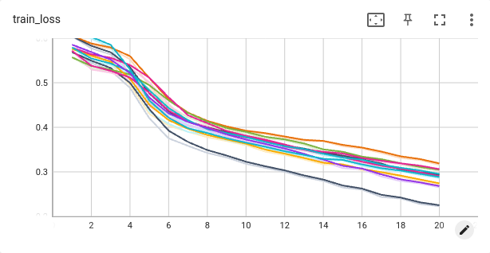
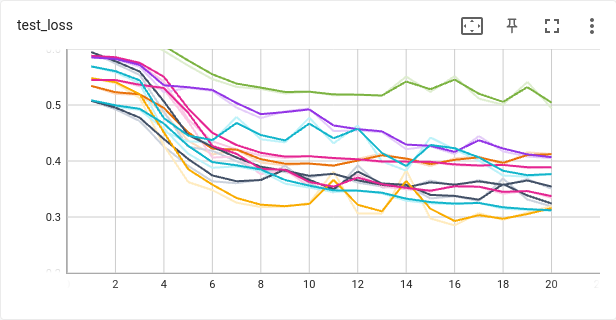

Weekly-supervised classification
================================================


Overview
------------
The solution is based on the paper [1] published in 2021 by Dawid Rymarczyk, Adriana Borowa, Jacek Tabor, and Bartosz Zieliński.

The authors considered an identical problem and derived a new approach called Self-Attention Attention-based Multiple Instance learning. Together with the paper, a framework is distributed with an MIT license, so I could build the solution around their work.


Data point preparation
------------
To meet crteria stated in the task, method of `MistBags` was modified with following code:

```python
while True:
    bag_length = int(self.r.normal(self.mean_bag_length, self.var_bag_length, 1))
    if bag_length >= 5 and bag_length <= 250000000:
        break
    else:
        continue
```
`While` loop assures that `bag_length < 5` and `bag_length > 2500000000` will be rejected and another attempt to pick up value from desired range will be made.

The objective is to verify if 7 exists in the bag, so the parameter `xor_number` was set to 7.


Evaluation of the model
------------
I trained and tested the model for several sets of parameters. The first observation is that the additional constraint mentioned above does not affect the loss function. This fact is not surprising because rejected bags of instances are anyway unlikely to appear, so the data set is not much modified. 

Below are presented train and test losses over 20 epochs for 10 different seeds. Undoubtedly, results are improving for all 10 random configurations of bags however, the variance cannot be neglected. Especially for test loss function. This suggests that the training of the model is sensitive to the specific configuration of the data set.  




----------

Conclusions
----------

Self-Attention Attention-based Multiple Instance learning is definitely powerful method and as author presetned in the paper[1] set new standards. As a new method, it can deal with new range of problems with bigger complexity that is already demostraed by the authors[2].


References
-------
[1] [Kernel Self-Attention for Weakly-supervised Image Classification using Deep
Multiple Instance Learning](https://ieeexplore.ieee.org/document/9423289)

[2] [ProtoMIL: Multiple Instance Learning with Prototypical Parts for Whole-Slide Image Classification](https://2022.ecmlpkdd.org/wp-content/uploads/2022/09/sub_346.pdf)